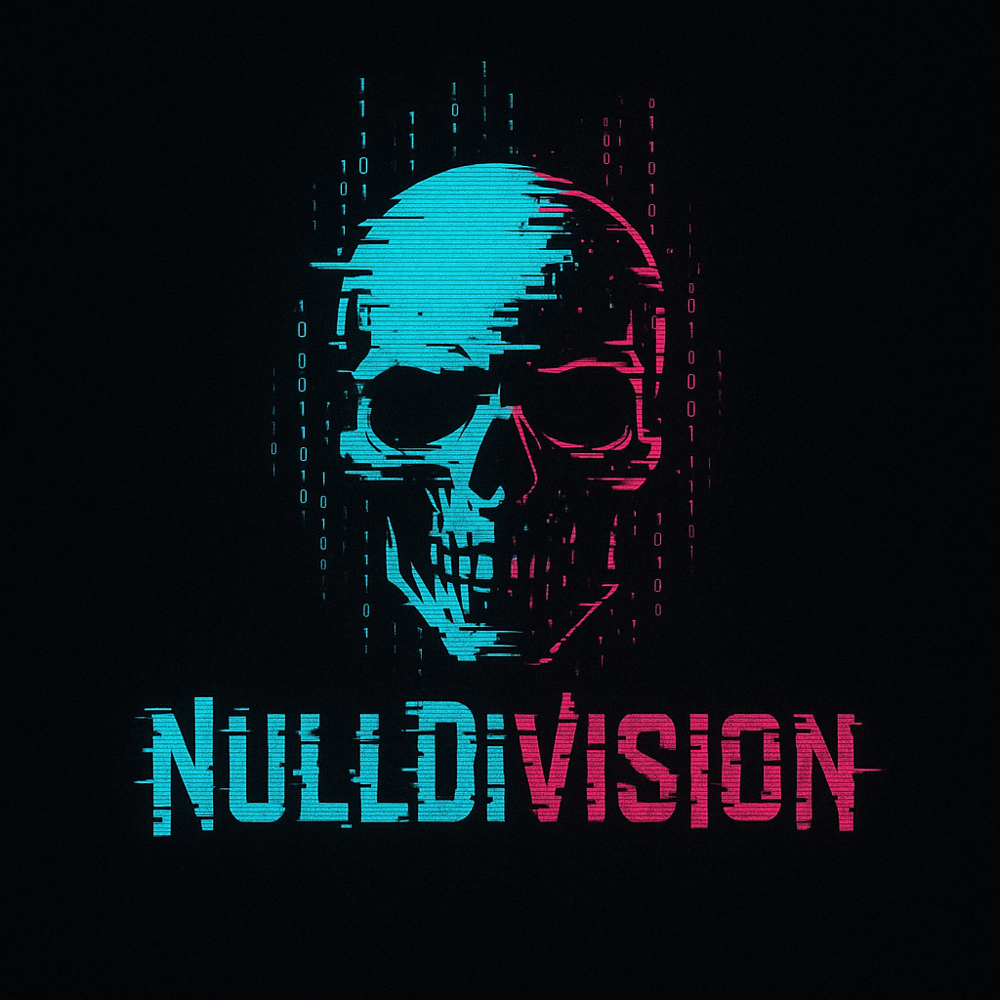

# NullDivision CTF

## Introduction
Welcome to the **NullDivision** CTF! You take on the role of an investigator who is cracking down on a hacking group called **NullDivision**. After a long investigation, you have managed to locate their server, which hosts a recruitment forum. New members of the group download a mobile app from it, which is used for communication between group members.

Your task is to:
1. **Decompile the mobile application** to understand how it works.
2. **Log in to the FTP server** as an `anonymous` user to download the application.
3. **Exploit errors in communication between the application and the server** to access the content of other users' tasks.

## Requirements
- **Docker** and **Docker Compose** installed on your system.
- Mobile application decompilation tools (e.g. `apktool`, `jadx`, `dex2jar`, `jd-gui`).
- Network traffic analysis tools (e.g. `Wireshark`, `Burp Suite`).

## Installation
1. Clone the repository:
   ```bash
 git clone https://github.com/your-repo/NullDivision_CTF.git 
 cd NullDivision_CTF
 ```

2. launch the environment using Docker Compose:
   ```bash
 docker-compose up --build -d
 ```.

3. verify that the container is running:
   ``bash
 docker-compose ps
 ```.

4. the FTP server will be available on port `21` and the application server on port `2137`.

## Tasks
1. **Log in to the FTP server**:
   - Use any FTP client to log in as `anonymous`.
   - Download the `nulldivision-client.apk` file.

   Login example:
   ```bash
 ftp localhost 21
 ```.

2 **Decompile the mobile app**:
   - Examine the app's code to understand how it communicates with the server.
   - Use tools such as:
     - `apktool`: To decompile the APK file and analyze XML files and resources.
     - `jadx`: For analyzing Java source code.
     - `dex2jar`: For converting `.dex` files to `.jar`.
     - `jd-gui`: For viewing `.jar` files in a readable form.

3 **Exploit communication errors**:
   - Identify weaknesses in the server API implementation.
   - Exploit them to access other users' task content.

## Background Story
You are an investigator who has been tracking the **NullDivision** hacking group for months. After many attempts, you have managed to locate their server, which acts as a recruitment forum. New members of the group download a mobile app from it, which allows communication between members.

Your goal is:
- Understand how the app works.
- Exploit bugs in its implementation to gain access to the group's confidential information.

## Useful tips
- **FTP**: The FTP server is configured in `anonymous` mode, which means you can log in without a password.
- **Decompilation**: Use tools such as `apktool`, `jadx`, `dex2jar` and `jd-gui` to analyze the application code.
- **Network traffic analysis**: Monitor the communication between the application and the server to identify potential vulnerabilities.

## Troubleshooting
- If the container is not working, check the logs:
  ``bash
 docker-compose logs
 ``.
- Make sure ports `21` and `2137` are open and not occupied by other processes.

## Authors
This CTF was created by **Oskar Biernacki** for CTF_PJATK_2025.

Good luck, investigators!